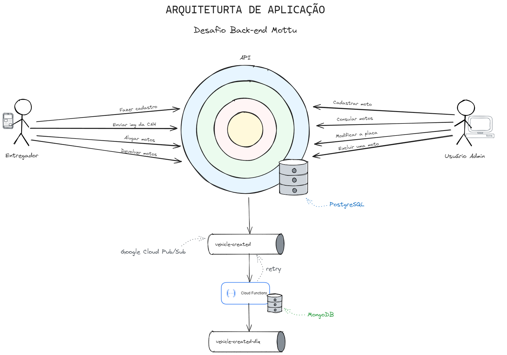
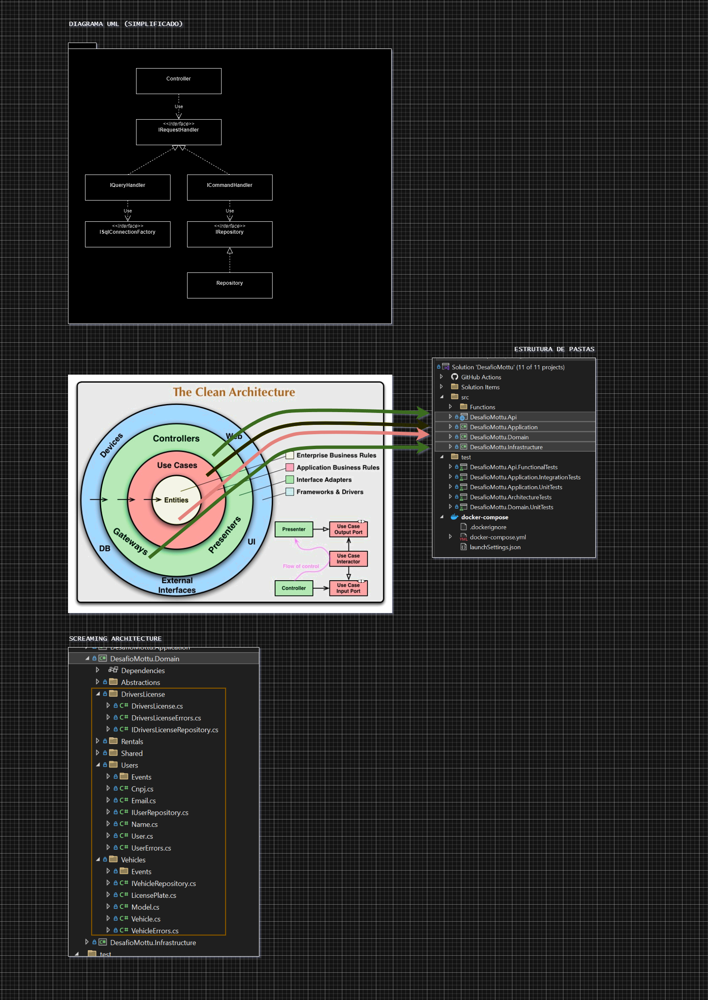
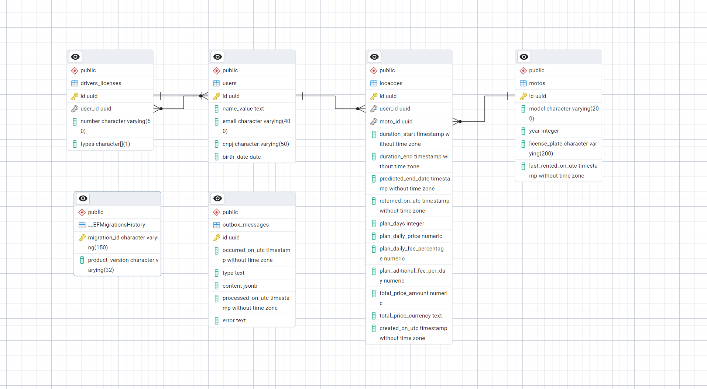

# Desafio Back-end

[](https://sonarcloud.io/summary/new_code?id=dannevesdantas_Desafio-BackEnd-Mottu)
[](https://sonarcloud.io/summary/new_code?id=dannevesdantas_Desafio-BackEnd-Mottu)

O objetivo é criar uma aplicação para gerenciar aluguel de motos e entregadores. Quando um entregador estiver registrado e com uma locação ativa poderá também efetuar entregas de pedidos disponíveis na plataforma.

#### Stack


## Executar a aplicação

1. Abra a solution `DesafioMottu.sln` no Visual Studio;
2. Defina o projeto `docker-compose` como projeto de inicialização;
3. Execute a aplicação;
4. Acesse o Swagger em https://localhost:5001/swagger/index.html

> [!IMPORTANT]  
> Após executar a API no Visual Studio é necessário fazer subscribe da Function no tópico `vehicle-registered` no emulador local do Google Cloud Pub/Sub. Para isso, use os comandos abaixo.

```bash
curl -s -X PUT 'http://localhost:8085/v1/projects/desafio-backend-mottu/topics/vehicle-registered'
```
```bash
curl -s -X PUT 'http://localhost:8085/v1/projects/desafio-backend-mottu/topics/vehicle-registered-dlq'
```
```bash
curl -s -X PUT 'http://localhost:8085/v1/projects/desafio-backend-mottu/subscriptions/mysub' -H 'Content-Type: application/json' --data '{"topic":"projects/desafio-backend-mottu/topics/vehicle-registered","pushConfig":{"pushEndpoint":"http://desafio-mottu-consumer:8080/projects/desafio-backend-mottu/topics/vehicle-registered"}}'
```

## Documentação

## Arquitetura de Aplicação

Arquitetura high-level da solução


*Clique na imagem para ampliar.*

## Padrão Arquitetural

Architectural Pattern: [Clean Architecture](https://blog.cleancoder.com/uncle-bob/2012/08/13/the-clean-architecture.html) + [Screaming Architecture](https://blog.cleancoder.com/uncle-bob/2011/09/30/Screaming-Architecture.html) + [Domain Model](https://www.martinfowler.com/eaaCatalog/domainModel.html) (DDD) + [CQRS](https://martinfowler.com/bliki/CQRS.html)


*Clique na imagem para ampliar.*

## DER - Diagrama Entidade Relacionamento


*Clique na imagem para ampliar.*

## Casos de uso
- Eu como usuário admin quero cadastrar uma nova moto. ✅
  - Os dados obrigatórios da moto são Identificador, Ano, Modelo e Placa ✅
  - A placa é um dado único e não pode se repetir.  ✅
  - Quando a moto for cadastrada a aplicação deverá gerar um evento de moto cadastrada ✅
    - A notificação deverá ser publicada por mensageria. ✅
    - Criar um consumidor para notificar quando o ano da moto for "2024" ✅
    - Assim que a mensagem for recebida, deverá ser armazenada no banco de dados para consulta futura. ✅
- Eu como usuário admin quero consultar as motos existentes na plataforma e conseguir filtrar pela placa. ✅
- Eu como usuário admin quero modificar uma moto alterando apenas sua placa que foi cadastrado indevidamente ✅
- Eu como usuário admin quero remover uma moto que foi cadastrado incorretamente, desde que não tenha registro de locações. ✅
- Eu como usuário entregador quero me cadastrar na plataforma para alugar motos. ✅
    - Os dados do entregador são( identificador, nome, cnpj, data de nascimento, número da CNHh, tipo da CNH, imagemCNH) ✅
    - Os tipos de cnh válidos são A, B ou ambas A+B. ✅
    - O cnpj é único e não pode se repetir. ✅
    - O número da CNH é único e não pode se repetir. ✅
- Eu como entregador quero enviar a foto de minha cnh para atualizar meu cadastro. ✅
    - O formato do arquivo deve ser png ou bmp.
    - A foto não poderá ser armazenada no banco de dados, você pode utilizar um serviço de storage( disco local, amazon s3, minIO ou outros). ✅
- Eu como entregador quero alugar uma moto por um período. ✅
    - Os planos disponíveis para locação são:
        - 7 dias com um custo de R$30,00 por dia ✅
        - 15 dias com um custo de R$28,00 por dia ✅
        - 30 dias com um custo de R$22,00 por dia ✅
        - 45 dias com um custo de R$20,00 por dia ✅
        - 50 dias com um custo de R$18,00 por dia ✅
    - A locação obrigatóriamente tem que ter uma data de inicio e uma data de término e outra data de previsão de término. ✅
    - O inicio da locação obrigatóriamente é o primeiro dia após a data de criação. ✅
    - Somente entregadores habilitados na categoria A podem efetuar uma locação ✅
- Eu como entregador quero informar a data que irei devolver a moto e consultar o valor total da locação. ✅
    - Quando a data informada for inferior a data prevista do término, será cobrado o valor das diárias e uma multa adicional ✅
        - Para plano de 7 dias o valor da multa é de 20% sobre o valor das diárias não efetivadas. ✅
        - Para plano de 15 dias o valor da multa é de 40% sobre o valor das diárias não efetivadas. ✅
    - Quando a data informada for superior a data prevista do término, será cobrado um valor adicional de R$50,00 por diária adicional. ✅

> _Legenda_\
> ✅ _Implementado_

## Diferenciais 🚀
- Testes unitários ✅
- Testes de integração ✅
- EntityFramework e/ou Dapper ✅ _(ambos)_
- Docker e Docker Compose ✅ _(ambos)_
- Design Patterns ✅
- Documentação ✅
- Tratamento de erros ✅
- Arquitetura e modelagem de dados ✅
- Código escrito em língua inglesa ✅ _(exceto os campos da API)_
- Código limpo e organizado ✅
- Logs bem estruturados ✅
- Seguir convenções utilizadas pela comunidade ✅

## Extras 💪🏻

- Cache com Redis ✅
- Logs com [Seq](https://datalust.co/seq) ✅
- Testes Funcionais ✅
- Architecture Tests com [NetArchTest](https://github.com/BenMorris/NetArchTest) ✅
- [Testcontainers](https://testcontainers.com/) ✅
- Aggregate Pattern (DDD) ✅
- Modelo de Domínio rico (DDD) ✅
- Outbox Pattern ✅
- Validação com Results Pattern ✅
- [Analise estática com SonarCloud](https://sonarcloud.io/summary/new_code?id=dannevesdantas_Desafio-BackEnd-Mottu) ✅
- Google Cloud Pub/Sub ✅
- Google Cloud Pub/Sub Emulator ✅
- Google Cloud Run Functions ✅ _(consumer)_
- CI com GitHub Actions ✅
- [Conventional Commits](https://www.conventionalcommits.org/) ✅

## Testes


## Observações adicionais

- Os códigos HTTP seguem o padrão RESTful.
- Seguindo as boas práticas, optei por implementar o campo `identificador` nas requests como GUID. O identificador GUID será gerado automaticamente no back-end e não precisa ser informado na request.
- As imagens das CNHs serão armazenadas em um volume do Docker em `app\Files\DriversLicenses` no container e em `.containers\app\Files\DriversLicenses` na máquina host. O nome do arquivo é o identificador GUID do entregador. As imagens serão convertidas automaticamente para .jpg
- Todas as combinações possíveis de planos e datas de entrega (considerando entrega adiantada/atrasada) foram testadas [aqui](https://github.com/dannevesdantas/Desafio-BackEnd/blob/main/test/DesafioMottu.Domain.UnitTests/Rentals/PricingServiceTests.cs).
- O Consumer foi implementado como uma Function do Google Cloud. O código se encontra dentro da solution do Visual Studio.
- Ao me espelhar no [Swagger de referência](https://app.swaggerhub.com/apis-docs/Mottu/mottu_desafio_backend/1.0.0#/loca%C3%A7%C3%A3o/put_locacao__id__devolucao) notei que o valor total, incluindo possíveis multas, não é exibido na response ao fazer PUT em `/locacao/{id}/devolucao`. Para que seja possível visualizarmos o valor final (incluindo multas) pela API ao fazer a devolução de uma moto, tomei a liberdade de incluir os campos adicionais `plano` e `valor_final` na response ao fazer GET em `/locacao/{id}`.
- O tópico do Pub/Sub funciona na máquina local, não é necessário fazer deploy da nuvem. O emulador do Pub/Sub do Google Cloud já está configurado no `docker-compose.yml`
- As mensagens consumidas pelo consumer, a partir do Pub/Sub, serão logadas na saída da Function. Use o comando `docker logs DesafioMottu.Consumer --follow` para visualizar os logs do consumer. (print abaixo)


Para esclarecimentos adicionais, fique à vontade para [entrar em contato](https://www.linkedin.com/in/dannevesdantas/).

## Métricas de código

[](https://sonarcloud.io/summary/new_code?id=dannevesdantas_Desafio-BackEnd-Mottu)
[](https://sonarcloud.io/summary/new_code?id=dannevesdantas_Desafio-BackEnd-Mottu)
[](https://sonarcloud.io/summary/new_code?id=dannevesdantas_Desafio-BackEnd-Mottu)
[](https://sonarcloud.io/summary/new_code?id=dannevesdantas_Desafio-BackEnd-Mottu)
[](https://sonarcloud.io/summary/new_code?id=dannevesdantas_Desafio-BackEnd-Mottu)
[](https://sonarcloud.io/summary/new_code?id=dannevesdantas_Desafio-BackEnd-Mottu)
[](https://sonarcloud.io/summary/new_code?id=dannevesdantas_Desafio-BackEnd-Mottu)
[](https://sonarcloud.io/summary/new_code?id=dannevesdantas_Desafio-BackEnd-Mottu)
[](https://sonarcloud.io/summary/new_code?id=dannevesdantas_Desafio-BackEnd-Mottu)
[](https://sonarcloud.io/summary/new_code?id=dannevesdantas_Desafio-BackEnd-Mottu)
[](https://sonarcloud.io/summary/new_code?id=dannevesdantas_Desafio-BackEnd-Mottu)

[](https://sonarcloud.io/summary/new_code?id=dannevesdantas_Desafio-BackEnd-Mottu)
